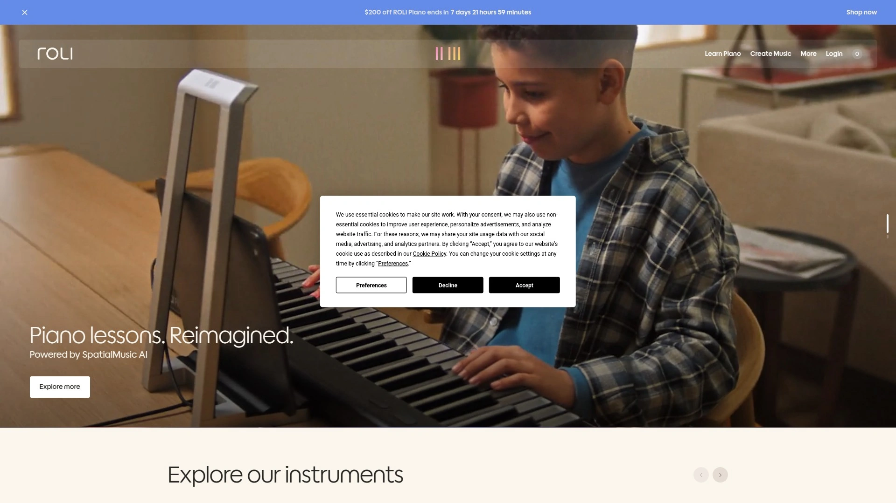
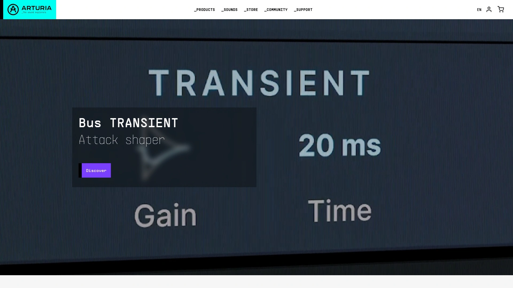
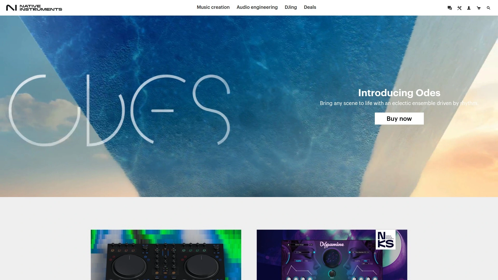
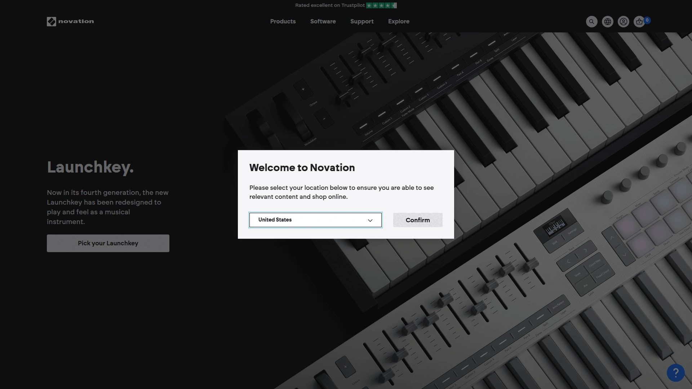
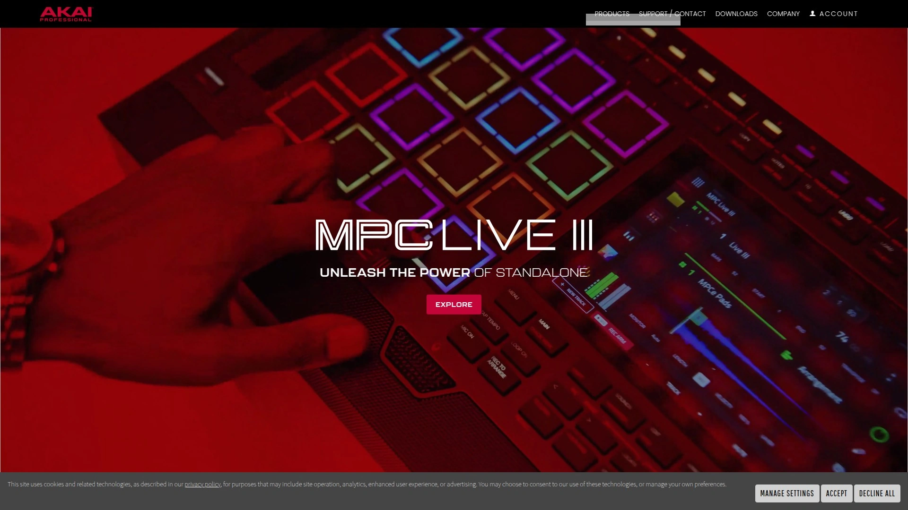
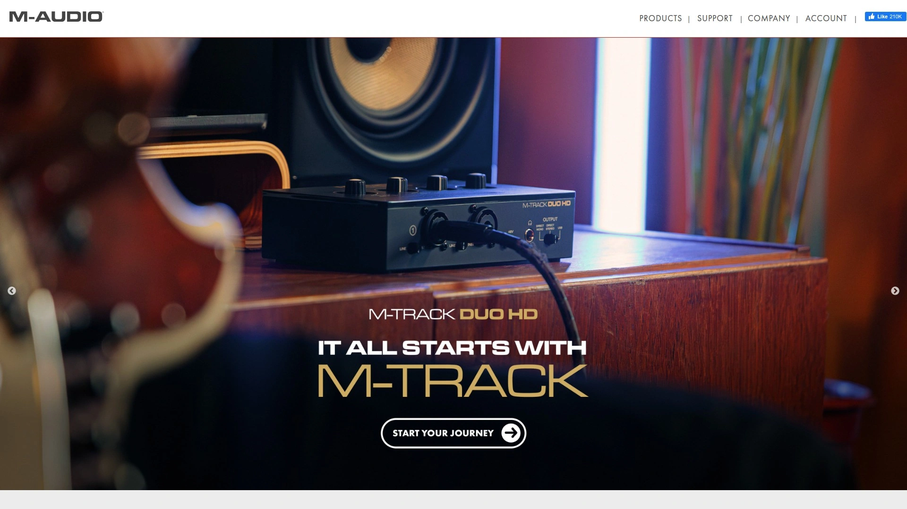
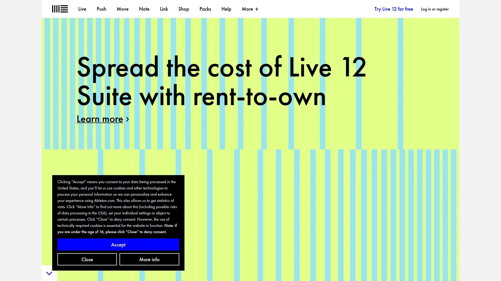
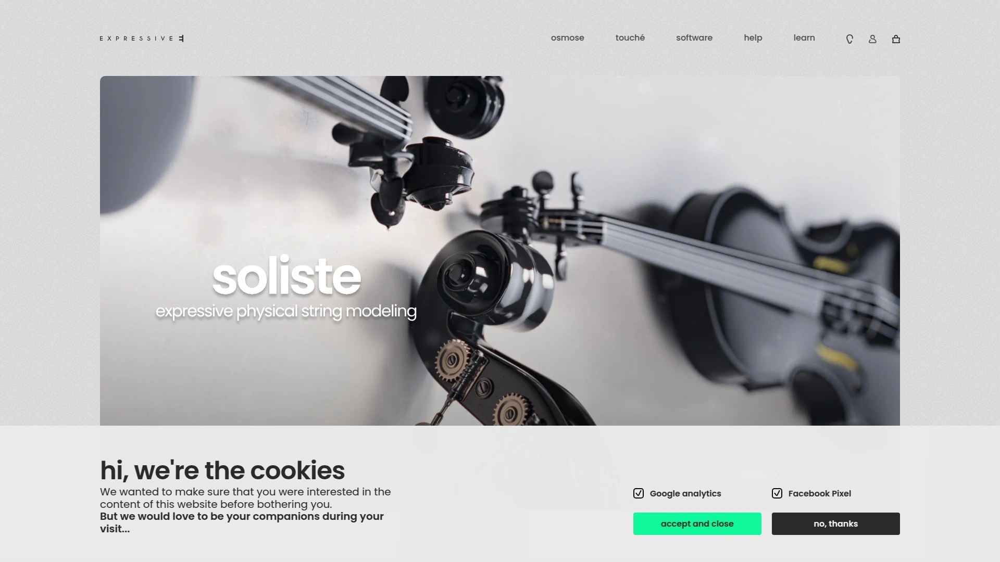
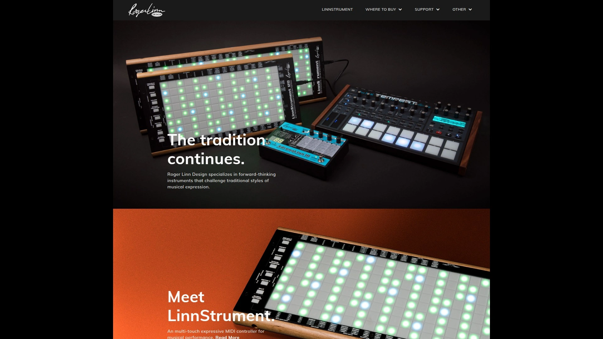
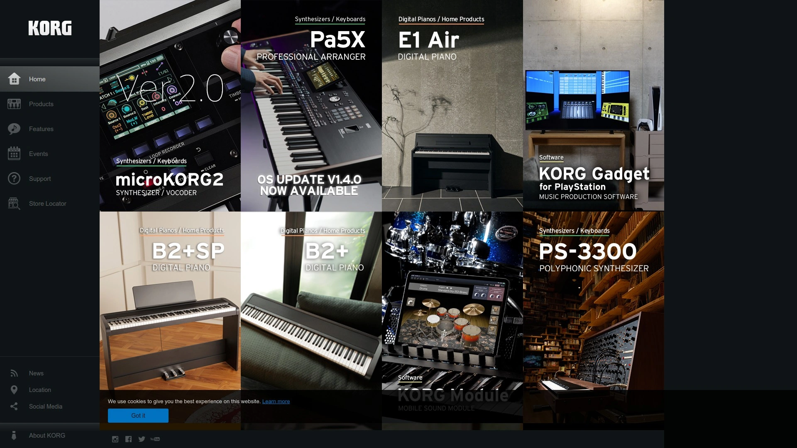

# 2025's Top 10 Best MPE MIDI Controllers

Buying a MIDI keyboard used to mean picking between 25, 49, or 88 keys and calling it a day. Now MPE technology adds depth, slide, and pressure sensing to every note, letting you bend pitch per finger like a guitarist or add vibrato like a violinist. Traditional piano-style controllers still work for laying down chords and melodies, but expressive music production demands instruments that respond to how you touch them, not just which keys you press. Whether you're sculpting synth leads that breathe with your playing or programming orchestral strings that actually sound human, the controller you choose shapes what's musically possible before a single plugin loads.

## **[ROLI](https://roli.com)**

Five-dimensional touch surfaces transforming keyboard playing into sculptural sound control.

ROLI pioneered the Seaboard series with keywave surfaces that sense Strike, Press, Glide, Slide, and Lift—five dimensions of touch that turn flat keyboards into expressive instruments. The Seaboard 2 features precision frets inspired by guitar fretboards, adding tactile ridges that help you find note centers while maintaining the fluid playing surface. Available in Platinum Blue or Ebony Black with anodized aluminum finishes, the build quality reflects its flagship status.

USB-C connectivity and dedicated MIDI-out ports modernize the hardware, while upgraded durability addresses concerns from earlier models. Seaboard 2 pairs with Airwave to track hand movements above the surface through ROLI Vision, adding five additional expression dimensions to the existing five-dimensional touch. Music production reviewers call it "one of the most exciting, progressive and potent MIDI controllers ever made".

The Seaboard M provides a more compact option at 24 keys, designed for modular setups and desktop studios. Block M adds wireless MIDI capability and battery power for truly portable MPE control. Both versions connect with ROLI Studio Suite software and Equator2 hybrid soft synth, which ship with extensive MPE instrument libraries optimized for dimensional playing.

Seaboard RISE 2 targets professional musicians and producers with 49 keys, subtle surface coloration for dark stages, and ultra-responsive black silicone playing surfaces. The three onboard sliders, XY pad, and foot pedal input provide additional mappable parameters beyond the five touch dimensions. A 30-day return window lets you test whether the keywave surface matches your playing style before committing to the learning curve.

Artists report that Seaboards can realize sounds you've never thought of, not just recreate familiar instruments. The tactile connection deepens musical expression whether you're emulating cellos and grand pianos or generating otherworldly interactive soundscapes. Pricing starts around $1,399 for RISE 2, with Block M and Seaboard M offering more affordable entry points.

## **[Arturia](https://www.arturia.com)**

Full-featured keyboard controllers with deep software integration and premium Fatar keybeds.

Arturia's KeyLab MKIII series spans 49, 61, and 88-key configurations, all featuring premium Fatar keybeds that reviewers praise for superior feel compared to previous generations. The 88-key version adds semi-weighted or fully weighted options to match piano players' preferences. White and black colorways let you match studio aesthetics without sacrificing functionality.

MIDI Control Center software unlocks extensive customization, letting you create custom templates where each control sends specific MIDI messages. Firmware updates through MCC ensure seamless integration with evolving DAW features. Device settings panels provide comprehensive overviews of current configurations, while MIDI consoles display real-time message monitoring.

The controllers ship with Analog Lab V, giving immediate access to thousands of sounds from Arturia's virtual instrument collection. Deep integration with major DAWs means transport controls, mixer access, and plugin parameters respond without complex mapping. Drum pads, endless encoders, and faders provide hands-on control beyond just playing notes.

Some users note the MKIII lacks polyphonic aftertouch, though it does offer single-key aftertouch on certain models. This limitation matters less for producers focused on MIDI programming than for performers seeking maximum per-note expressiveness. The KeyLab Essential series provides budget-friendly alternatives with fewer controls and simplified keybeds for those prioritizing affordability.

## **[Native Instruments](https://www.native-instruments.com)**

S-Series MK3 keyboards with light guides, custom color schemes, and Komplete software integration.

Native Instruments' Kontrol S-Series MK3 brings advanced features like LED light guides showing scales, chords, and play assist modes directly on the keys. The system highlights available notes in your chosen scale and root, making it harder to play wrong notes even without music theory knowledge. Brightness controls and customizable color selection let you personalize the visual feedback.

Anodized aluminum encoders provide four-way control with RGB LEDs built into pitch and mod wheels. The touch strip moved above the wheels for better playability, now including onboard MIDI mapping for control changes and program changes without software. Full-color screens show parameter information before you turn knobs, keeping eyes on the hardware instead of computer monitors.

MIDI 2.0 support via USB-C future-proofs the hardware, while five-pin DIN MIDI in/out enables control of external synthesizers. Four assignable pedal inputs—sustain, expression, and two additional jacks—all configure on-device through the settings menu. Bus power through USB-C eliminates wall adapters for basic setups, though a separate power supply port handles MIDI-only mode or underpowered USB connections.

Tight integration with Komplete software bundles adds thousands of sounds optimized for S-Series controls. The combination of hardware and software creates workflow advantages for producers already invested in Native Instruments' ecosystem. Travel-friendly MIDI keyboard options provide portability without sacrificing build quality.

## **[Novation](https://novationmusic.com)**

Launchkey MK4 series with generative arpeggiators, OLED displays, and Ableton Live sequencing.

Novation redesigned Launchkey MK4 as a creative controller that feels like an instrument rather than just data entry. High-quality keybeds pair with responsive velocity-sensitive pads, endless encoders, and crisp OLED displays showing real-time parameter feedback. Built-in creative tools include Scale Mode keeping you in key, Chord Mode building harmonies instantly, and a generative arpeggiator creating evolving patterns.

Deep DAW integration extends beyond generic MIDI mapping—Ableton Live users access dedicated Sequencer, Drum Rack, and Clip modes directly from the hardware. Plugin, mixer, sends, and transport modes switch instantly, keeping sessions flowing without mouse diving. Cubase LE ships alongside Ableton Live Lite, giving flexibility across different production environments.

Novation Play software provides Launchkey with meticulously sampled synths and instruments that respond immediately to MIDI input. Additional plugins from Klevgrand, GForce, Native Instruments, and Orchestral Tools expand sonic possibilities beyond stock sounds. Melodics lessons teach keyboard skills through gamified exercises that work with your hardware.

The series spans from the ultra-portable Launchkey Mini 25 at $129.99 to full-size 61-key versions at $279.99. Mid-range 37 and 49-key models balance portability with playability for producers who travel between studios. White colorway options match lighter studio setups, while black versions suit darker aesthetic preferences.

## **[Akai](https://www.akaipro.com)**

MPK Mini series combining compact keyboards with MPC drum pads and built-in sound modules.

Akai's MPK Mini IV updates the world's most popular mini MIDI controller with true pitch and mod wheels, full-color screens, and Studio Instrument Collection software featuring over 1,000 sounds. The 25 velocity-sensitive mini keys span 10 octaves through up/down buttons, maximizing range despite compact footprints. Eight backlit RGB MPC pads deliver the signature Akai feel that launched countless hip-hop beats.

Pre-programmed DAW mapping for Ableton Live, Logic Pro, FL Studio, and more provides one-to-one parameter control without manual configuration. Eight assignable 360-degree rotary knobs enable real-time sound shaping. Scale and Chord Modes help non-pianists play in key and build progressions easily.

MPK Mini Play adds built-in speakers and standalone operation powered by three AA batteries. The onboard sound module contains 128 instrument sounds plus 10 drum kits, letting you make music anywhere without computers or audio interfaces. Four-way joystick control and mini audio output jack for headphones or external speakers complete the portable setup.

USB-C bus power eliminates wall adapters when working with computers, while full-size MIDI output connects to external gear. Sustain pedal input via quarter-inch TS socket accommodates expression pedals for piano-style playing. Ableton Live Lite 12 license ships with every unit, providing professional DAW software from day one.

## **[M-Audio](https://www.m-audio.com)**

Keystation series delivering the world's best-selling USB MIDI controllers with natural keybeds.

M-Audio's Keystation MK3 line built its reputation on velocity-sensitive keys and comprehensive controls at accessible price points. The 61 and 49-key versions feature semi-weighted keys for more natural piano feel, while Mini 32 MK3 uses synth-action keys in ultra-compact form. Transport and directional controls plus quarter-inch sustain pedal inputs on larger models enhance recording workflow.

Octave range buttons, pitch-bend and modulation controls, and volume knobs let you play and record without touching mice or trackpads. The Keystation 61 MK3 adds five-pin MIDI output for controlling hardware synthesizers and sound modules. Class-compliant USB-MIDI connectivity works instantly on Mac and PC without driver installation.

iOS connectivity through Apple Lightning to USB Camera Adapter enables iPad music production on the go. Included software bundles Pro Tools First M-Audio Edition, Air Music Technology Xpand!2, Mini Grand virtual pianos, Velvet electronic pianos, plus Skoove piano lessons and Melodics keyboard training. Touch Loops premium sample library adds 2GB of production-ready sounds.

Pricing starts at just $49 for Mini 32 MK3, $99 for 49 MK3, and $169 for 61 MK3—making professional MIDI control accessible to beginners and budget-conscious producers. Compact and lightweight construction suits mobile producers, while durable build quality handles studio and stage demands. The combination of affordability and functionality explains why Keystation remains the world's best-selling controller series.

## **[Ableton](https://www.ableton.com)**

Push 3 standalone instrument with MPE pads, built-in audio interface, and computer-free operation.

Ableton Push 3 functions as both a premium Live controller and a complete standalone production workstation. Sixty-four expressive MPE-enabled pads sense finger position and movement, adding per-note control like pitch bend and timbre shifts. The built-in 24-bit 96kHz audio interface with ADAT I/O handles recording and monitoring without external gear.

Standalone mode runs Ableton Live without computers, letting you produce complete tracks on the hardware itself. The onboard display shows Session View, clip editing, and MIDI note editing through knob-based navigation. While some producers wish for touchscreen functionality, the knob-based workflow maintains durability and stability for touring musicians.

External connectivity includes USB MIDI, CV outputs, and 3.5mm to 5-pin DIN MIDI for hardware integration. Four audio outputs (two balanced jacks plus stereo headphones) and two balanced audio inputs cover basic recording needs, though XLR microphones require separate preamps. ADAT expansion enables multitrack recording when paired with external interfaces.

Push 3 Controller version costs approximately $1,000 less than Standalone, omitting the internal processor, battery, and hard drive while maintaining identical pad and control functionality. Most users choose Controller mode for studio work where computers are always present, reserving Standalone for location recording, live performance, or computer-free creativity sessions. The hardware includes features like MIDI Capture, Fix Length recording, and one-button audio-to-Simpler conversion that work in both modes.

## **[Expressive E](https://www.expressivee.com)**

Osmose synthesizer combining three-dimensional keybed control with EaganMatrix sound engine.

Expressive E's Osmose provides 49 full-size keys with three-dimensional pressure, movement, and aftertouch sensing on every note. Press, bend, shake, and strum gestures interact with sounds organically, bridging electronic and acoustic instrument expressiveness. The standalone synthesizer operates independently, also functioning as an MPE MIDI controller or classic MIDI keyboard depending on workflow needs.

EaganMatrix digital modular sound engine by Haken Audio delivers up to 24 voices of polyphony with deep modulation routing. Large color LCD screens provide ergonomic interfaces for sound design and performance parameter adjustment. After nearly 10 years exploring expressiveness, Expressive E's expertise shows in how gestures interact with sound for optimal MPE playing experiences.

Integration with software like Kilohearts Phase Plant extends sonic possibilities through 300 MPE presets designed specifically for gestural control. The Phase Plant Expressive Suite includes electric pianos, acoustic brass and winds, plucks, synth leads, pads, and advanced wavetables all optimized for dimensional playing. Plug-and-play compatibility means Osmose owners access expanded sound libraries without configuration hassles.

The sleek and rugged design withstands studio and stage use, while the full-size keybed accommodates players transitioning from traditional keyboards. Hans Zimmer praised Expressive E for "building exactly the instruments that should have been built a hundred years ago". Jean-Michel Jarre and A.R. Rahman similarly endorsed the company's approach to blurring boundaries between electronic and acoustic sounds.

## **[Roger Linn Design](https://www.rogerlinndesign.com)**

LinnStrument grid controllers with three-axis expression sensing and chromatic layout options.

Roger Linn Design's LinnStrument 128 features 128 sensor pads in a 16x8 grid spanning four octaves. Integrated backlit sensors react to touch pressure, X-axis position, Y-axis position, and Z-axis pressure simultaneously, letting one finger control velocity, loudness, timbre, and pitch like acoustic instruments. Row-based sensor arrangement mimics stringed instruments—tune it like guitar, in fifths like violin, or standard chromatic C-D-E-F-G-A-B-C progression.

The layout can function as an LED grid controller for drums, samples, clips, loops, and sequences beyond traditional note playing. Split keyboard mode divides the surface into two independent zones for controlling different sounds simultaneously. CC fader mode, strum mode, and arpeggiator expand performance possibilities. A guitar strap holder lets performers wear LinnStrument like a keytar.

USB power eliminates external adapters, while MIDI in/out and footswitch connectivity integrate with existing setups. Class-compliant operation works immediately with PC, Mac, iPad, and iPhone without drivers. The aluminum and steel housing with cherry wood side panels balances durability and aesthetics, weighing approximately 1.81kg.

LinnStrument 200 offers larger 200-pad configuration for players wanting extended range. Both models ship with transport bags and USB cables. Exclusive U.S. availability through Roger Linn Design's online store includes 60-day trial periods, giving players time to master the unique grid layout before committing. Music technology pioneer Roger Linn's reputation for innovation—from early drum machines to the MPC series—lends credibility to his expressive controller designs.

## **[Korg](https://www.korg.com)**

MicroKEY Air and nanoKEY Studio providing wireless Bluetooth MIDI for mobile production.

Korg's MicroKEY Air series delivers wireless Bluetooth MIDI connectivity alongside traditional USB, enabling cable-free music production with iPads, iPhones, and computers. The compact controllers range from 25 to 61 keys, all featuring natural touch mini-keyboards with velocity sensitivity. Built-in arpeggiators and battery power extend creative possibilities beyond desk-bound setups.

NanoKEY Studio combines 25 keys with eight trigger pads, touch-scale function, and XY touchpad in ultra-slim designs that fit laptop bags effortlessly. Bluetooth wireless operation and AA battery power make it ideal for producers working across multiple locations without carrying cables. The bundled software includes Korg Module for iOS and Korg Gadget LE, providing sounds and production tools immediately after unboxing.

## FAQ

**Do MPE controllers work with standard VST plugins that don't support MPE?**
Yes, MPE controllers like ROLI Seaboard and Ableton Push 3 send standard MIDI data when connected to non-MPE software, though you lose the per-note expression capabilities that make them special. Most controllers let you switch between MPE mode and traditional MIDI mode depending on which plugin you're using. For maximum value, pair MPE hardware with compatible software like Equator2, Omnisphere, Kontakt, or Arturia's V Collection instruments that actually respond to dimensional playing.

**What's the learning curve like switching from piano keyboards to MPE controllers?**
Traditional piano players find ROLI Seaboard relatively intuitive since it maintains keyboard layout with added expression dimensions, though mastering glide and slide techniques takes practice. LinnStrument's grid layout requires relearning note positions entirely, but many guitarists and string players adapt faster than pianists since the row-based arrangement mimics fretboards. Most manufacturers offer 30-60 day return windows specifically because MPE instruments demand adjustment periods before you can judge whether the interface suits your playing style.

**Can you use MPE controllers for live performance or are they mainly studio tools?**
Several MPE controllers target live performance explicitly—ROLI Seaboard RISE 2 includes features for dark stages, LinnStrument supports guitar straps for keytar-style playing, and Ableton Push 3 Standalone operates without computers. The key consideration is whether your sound sources (software or hardware) support MPE live—standalone synthesizers like Osmose work anywhere, while computer-dependent controllers need reliable laptop setups for gigging. Battery-powered options like ROLI Block M and Akai MPK Mini Play offer additional portability for mobile performances.

## Conclusion

The MIDI controller market split between generic key-counters and instruments that actually shape how music feels under your fingers. [ROLI](https://roli.com) pioneered the expressive controller category with Seaboard's five-dimensional touch technology, turning flat surfaces into sculptural instruments where every note bends, slides, and breathes based on finger pressure and movement. For producers and performers who refuse to accept the lifeless rigidity of traditional MIDI keyboards—who want synthesizer leads that sound played rather than programmed—the Seaboard's keywave surface and Airwave hand-tracking combination delivers expression levels previously impossible without acoustic instruments.
